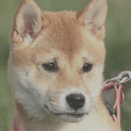
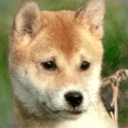
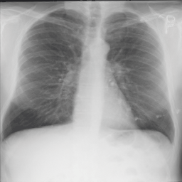

# SPHInX: Improved StyleGAN-v2 based Inversion for Out-of-Distribution Images

This repository hosts the official PyTorch implementation of the paper: "Improved StyleGAN-v2 based Inversion for Out-of-Distribution Images".

## Abstract
> 
Inverting an image onto the latent space of pre-trained generators, e.g., StyleGAN-v2, has emerged as a popular strategy to leverage strong image priors for ill-posed restoration. Several studies have showed that this approach is highly effective at inverting images similar to the data used for StyleGAN training (e.g., FFHQ faces). However, with out-of-distribution (OOD) data that the generator has not been exposed to, existing inversion techniques often produce highly sub-optimal results. In this paper, we propose SPHInX (StyleGAN with Projection Heads for Inverting X), an approach for accurately embedding OOD images onto the StyleGAN latent space. SPHInX adopts a novel training strategy that jointly optimizes: (i) a carefully designed style projection head that replaces the mapping network in StyleGAN; (ii) a content projection head; and (iii) noise latent variables in every layer. Our empirical studies with a suite of OOD data show that, in addition to producing higher quality image reconstructions over the state-of-the-art GAN inversion techniques, SPHInX is effective at conventional restoration problems such as denoising and compressed sensing while offering semantic editing capabilities. 
## Results

<!-- ### Brightness Attribute

### Rotation Attribute

### Image Morphing
 -->

##  Installation
First install the python dependencies by running `pip install -r requirements.txt`.

Next, download the StyleGAN pretrained weights and store in folder 
'model':

`gdown --id 1JCBiKY_yUixTa6F1eflABL88T4cii2GR` (stylegan pre-trained checkpoint)

If you don't have gdown installed, run: `pip install gdown` first.

## Examples
### Solving inverse problems
The script `main.py` can be used for out-of-distribution image inversion, denoising, and attribute direction discovery, etc.

#### Reconstruction

Example command:

`python main.py --size=256 --step=5000 --img_path='./samples/true_image/CXR.jpg'`

#### Denoising

Example command:

`python main.py --size=256 --step=5000 --img_path='./samples/true_image/CXR.jpg' --ops 'denoising' --ops_fac 0.25`

#### Rotation attribute

Example command:
`python main.py --size=256 --step=5000 --img_path='./samples/true_image/CXR.jpg' --attribute 'rotate' --attribute_fac 0 22.5 45`

## Acknowledgments

We use the StyleGAN-2 PyTorch implementation of the following repository: https://github.com/rosinality/stylegan2-pytorch.
We wholeheartedly thank the author for open-sourcing this implementation.

The PyTorch implementation is based on the official Tensorflow implementation: https://github.com/NVlabs/stylegan2.
We are grateful to the authors of StyleGAN-2 for their work and their open-sourced code and models.

